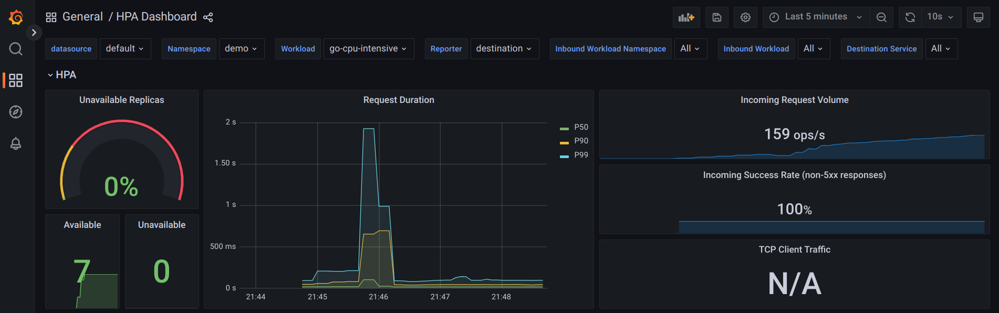

# Kubernetes HPA Demo

This repo is composed of two demonstrations.
1. [HPA with CPU metrics](./part1_cpu_metrics/README.md)
    * Tutorial: [Kubernetes HPA Hands-on](https://ryo-koike.com/blog/k8s-hpa-handson)
2. [HPA with Istio metrics (requests_per_second, 90%tile request processing duration)](./part2_istio_metrics/README.md)
    * Tutorial: [Kubernetes Horizontal Pod Autoscaler (HPA) with Custom Metrics from Istio](https://ryo-koike.com/blog/hpa-with-istio-metrics)




## How to create a docker image with multiple platform?
1. Create a builder
```sh
docker buildx create --name armamd
```

2. Select the created builder
```sh
docker buildx use armamd
```

3. Build an image targeting `linux/arm64` and `linux/amd64`
```sh
docker buildx build --platform linux/amd64,linux/arm64 -t ryojpn/go-cpu-intensive:latest .
```
Replace `ryojpn` with your DockerHub ID.

Optionally, you can add `--push` option to directly push the built image.
