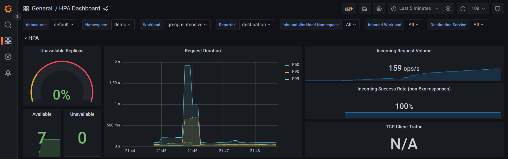

# Part 2: Kubernetes HPA with custom metrics from Istio

## Tested Environment

* Ubuntu 22.04
* MicroK8s v1.26.4
* Kubernetes v1.26.4


## Setup

1. Deploy Istio, Prometheus Adapter, kube-state-metrics using helmfile (before this, make sure to install [helmfile](https://github.com/helmfile/helmfile) and run `helmfile init` to install `helm-diff` plugin):
```sh
helmfile sync
```

2. Deploy Istio addons and our workload using Kustomize
```sh
kubectl apply -k ./
```

In case you get only 1 pod (e.g., READY 1/1 or READY 0/1) from `kubectl -n demo get po`, Istio injection was not successful.
Please run `kubectl -n demo rollout restart deploy` to restart the pod.
After this, you should get READY 2/2 from `kubectl -n demo get po`


<details>
<summary> Verify custom metrics can be fetched from Kubernetes API </summary>

1. `requests_per_second`
```sh
kubectl get --raw /apis/custom.metrics.k8s.io/v1beta1/namespaces/demo/services/go-cpu-intensive/requests_per_second
```

The output should look like:
```json
{
  "kind": "MetricValueList",
  "apiVersion": "custom.metrics.k8s.io/v1beta1",
  "metadata": {},
  "items": [
    {
      "describedObject": {
        "kind": "Service",
        "namespace": "demo",
        "name": "go-cpu-intensive",
        "apiVersion": "/v1"
      },
      "metricName": "requests_per_second",
      "timestamp": "2023-06-04T02:26:01Z",
      "value": "3171m",
      "selector": null
    }
  ]
}
```

2. `request_duration_seconds_90ile`
```sh
kubectl get --raw /apis/custom.metrics.k8s.io/v1beta1/namespaces/demo/deployments/go-cpu-intensive/request_duration_seconds_90ile
```

The output should look like:
```json
{
  "kind": "MetricValueList",
  "apiVersion": "custom.metrics.k8s.io/v1beta1",
  "metadata": {},
  "items": [
    {
      "describedObject": {
        "kind": "Deployment",
        "namespace": "demo",
        "name": "go-cpu-intensive",
        "apiVersion": "apps/v1"
      },
      "metricName": "request_duration_seconds_90ile",
      "timestamp": "2023-06-04T02:25:15Z",
      "value": "0",
      "selector": null
    }
  ]
}
```

</details>


## Cleanup

```sh
kubectl delete -k ./
helmfile destroy
kubectl delete ns monitoring istio-system
```


## Experiment

1. Watch changes in HPA:
```sh
kubectl -n demo get hpa -w
```

2. In another terminal, run a loadtest
```sh
k6 run -e URL=http://localhost/ ../loadtest.js
```
Make sure to [adjust the URL](https://github.com/ryojp/istio-observability#curl-localhost-hangs) if you get 404 error.

3. Open Grafana and [import dashboard](https://grafana.com/docs/grafana/latest/dashboards/manage-dashboards/#import-a-dashboard)
```sh
# Port-forward Grafana on localhost:3001
kubectl -n istio-system port-forward svc/grafana 3001:3000
```
Copy the entire JSON file of [HPA Dashboard](./hpa_dashboard.json) and paste it on Grafana(http://localhost:3001) -> `Dashboards` (left-most panel) -> `Import`

After import, you should see a dashboard like:



## How did I generate `istio-demo.yml`?

Using `istioctl` of version 1.15.3,
```sh
istioctl manifest generate --set profile=demo > istio-demo.yml
```

After that, I added `istio-system` namespace definition at the top.

Also, I replaced all the three occurrences of `policy/v1beta1` with `policy/v1` because I got the following errors when applying the generated manifest:
```
no matches for kind "PodDisruptionBudget" in version "policy/v1beta1"
```

[A GitHub issue](https://github.com/kubernetes-sigs/metrics-server/issues/1104) also reports the same error and the fix.
